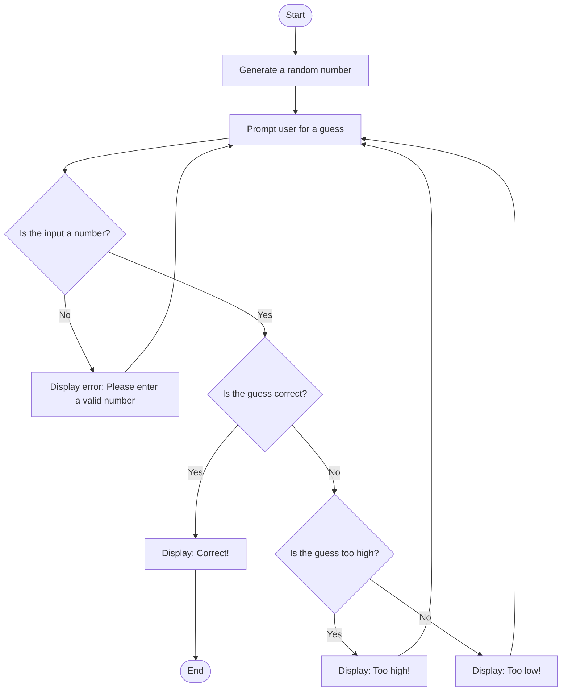

### Explanation of Each Step:

- **Start**: The game begins.
- **Generate a random number**: The computer generates a random number within a specified range.
- **Prompt user for a guess**: The user is asked to input a guess.
- **Is the input a number?**: The game checks if the user input is a valid number.
  - If **No**, an error message is displayed, asking the user to enter a valid number.
  - If **Yes**, the game proceeds to check if the guess is correct.
- **Is the guess correct?**: The game checks if the user's guess matches the generated number.
  - If **Yes**, the game displays a "Correct!" message and ends.
  - If **No**, the game checks whether the guess is too high or too low.
- **Is the guess too high?**: The game checks if the user's guess is greater than the generated number.
  - If **Yes**, the game displays a "Too high!" message and prompts the user to guess again.
  - If **No**, the game displays a "Too low!" message and prompts the user to guess again.
- **End**: The game ends when the correct number is guessed.
